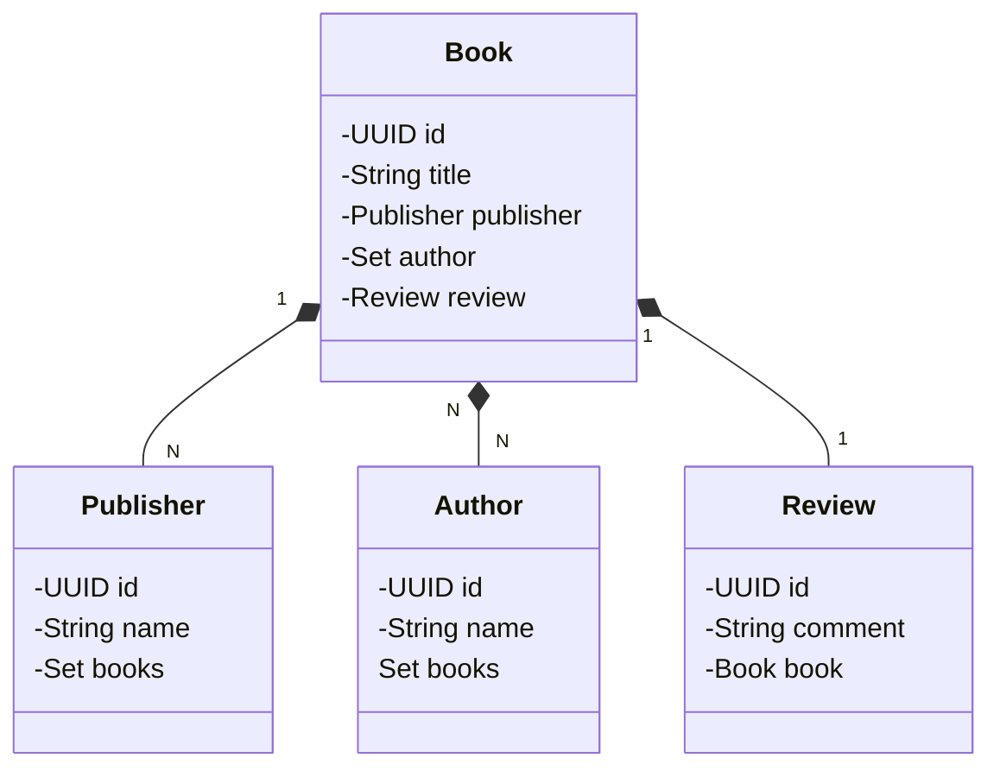

# Bookstore RESTful API

Este projeto é uma aplicação Spring Boot desenvolvida com Java 17. Ela fornece uma API RESTful para gerenciar Livros, Editoras e Autores.

## Principais Tecnologias
 - **Java 17**: A versão LTS do Java, oferecendo recursos de produtividade e desempenho aprimorados.;
 - **Spring Boot 3**: Framework para desenvolvimento rápido e simplificado de aplicações Java.
 - **Spring Web**: Módulo do Spring Framework para desenvolvimento de APIs RESTful.
 - **Spring DevTools**: Fornece reinicialização dinâmica de código e atualização automática do navegador, facilitando o desenvolvimento.
 - **Spring Data JPA**: Abstrai o acesso ao banco de dados relacional PostgreSQL, permitindo interações com entidades usando JPA.
 - **PostgreSQL Driver**: Driver JDBC para conectar ao banco de dados PostgreSQL.
 - **OpenAPI (Swagger)**: Vamos criar uma documentação de API eficaz e fácil de entender usando a OpenAPI (Swagger), perfeitamente alinhada com a alta produtividade que o Spring Boot oferece;


## Diagrama de Classes (Domínio da API)



# A API expõe os seguintes endpoints para gerenciar os livros(Books):

**POST** http://localhost:8080/bookstore/books Cria um novo Livro. O corpo da requisição deve conter um objeto válido.


# Execução e uso dos endpoints:

>Criando um Book(Livro) (POST /bookstore/books):

Método HTTP: POST
URL: http://localhost:8080/bookstore/books
Corpo da Requisição: {}
Conteúdo: Objeto JSON representando o novo livro.
Tipo de Conteúdo: application/json

Exemplo:
```
{
  "title": "Domain Drive Design",
  "publisherId": "9bf4c11c-f8d2-47a8-8507-1d4410b6d0df",
  "authorId": ["4b937cf9-2f47-46d6-86b6-d2876084a642"],
  "reviewComment": "Reunindo práticas de design e implementação, este livro incorpora vários  exemplos baseados em projetos que ilustram a aplicação do design dirigido por domínios no desenvolviemnto de softwares na vida real."
}
```

# Execução da Aplicação
  
>Pré-requisitos:
- Java 17 instalado e configurado no PATH do sistema.
- Banco de dados PostgreSQL instalado e configurado (opcional, para persistência real).
- Configuração do Banco de Dados (Opcional):
- Edite a configuração do banco de dados (por exemplo, application.properties) para especificar os detalhes de conexão ao PostgreSQL.
- Compilação e execução:
- Execute o comando mvn clean install para compilar o projeto.
- Execute a classe principal (geralmente com.example.ProjetoApplication) usando o comando:
```
java -jar target/jpa-0.0.1-SNAPSHOT.jar
```